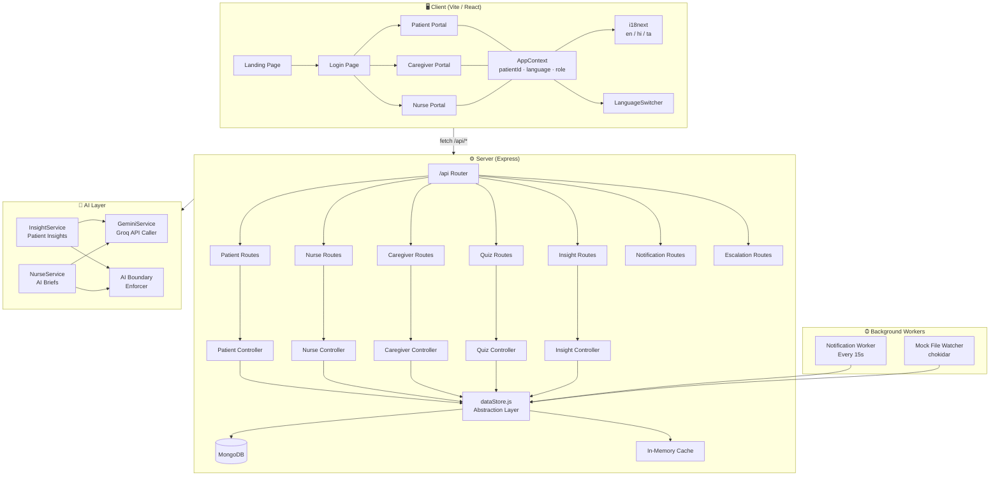
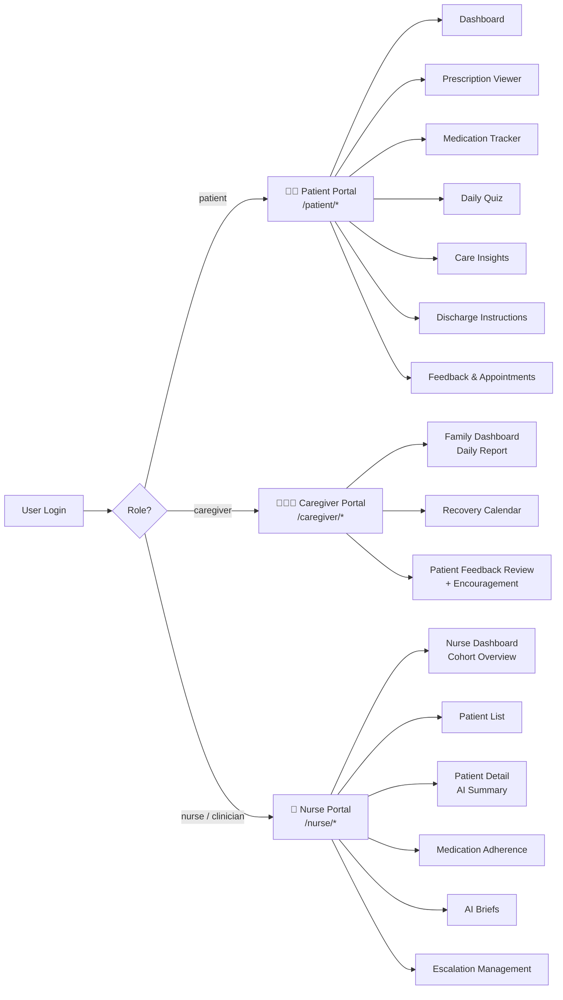
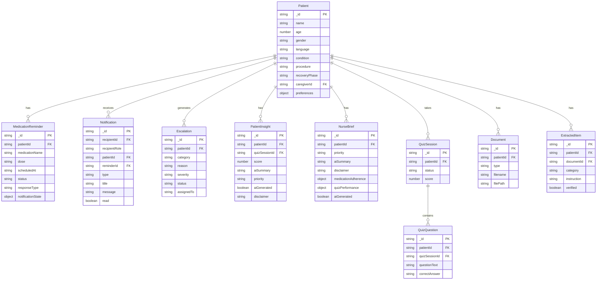
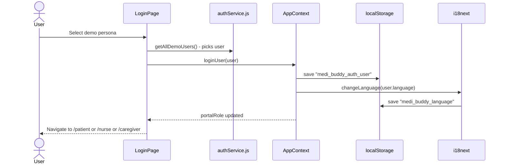
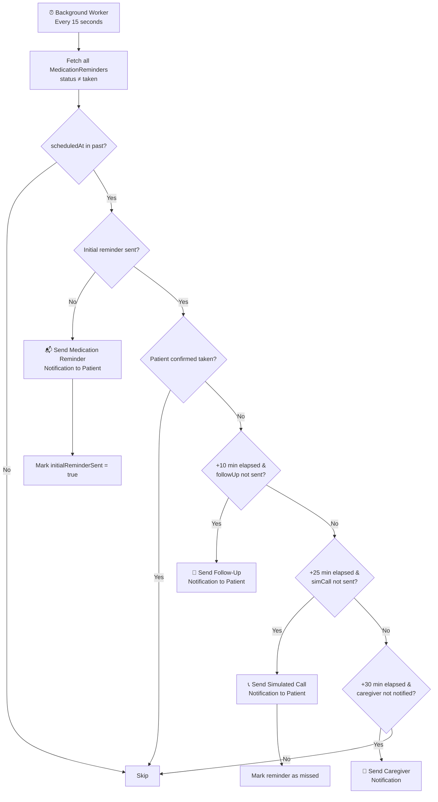
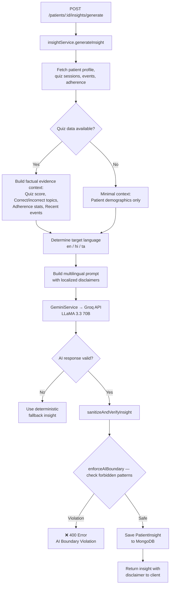
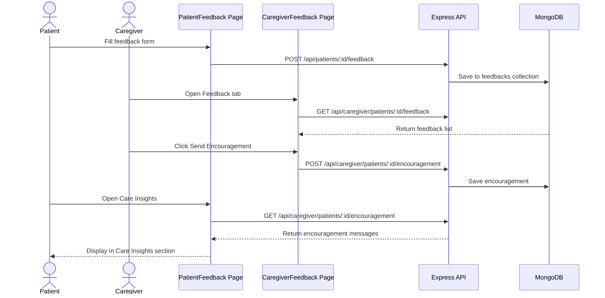
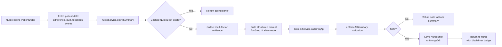
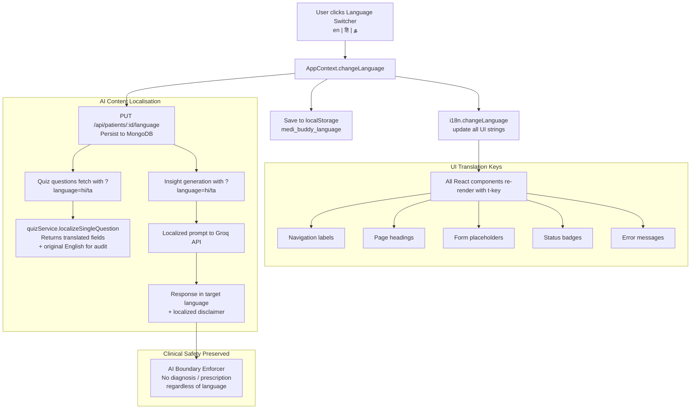

# 🏥 MediBuddy — CareBridge Post-Discharge Care Platform

> **A full-stack MERN application** for post-discharge patient care monitoring, connecting patients, family caregivers, and clinical nurses in a unified, multilingual health platform.

---

## 📋 Table of Contents

1. [Overview](#overview)
2. [Tech Stack](#tech-stack)
3. [System Architecture](#system-architecture)
4. [Role-Based Portals](#role-based-portals)
5. [Application Routes](#application-routes)
6. [API Endpoints Reference](#api-endpoints-reference)
7. [MongoDB Data Models](#mongodb-data-models)
8. [Key Feature Flows](#key-feature-flows)
9. [Multilingual System](#multilingual-system)
10. [AI & Clinical Safety](#ai--clinical-safety)
11. [Project Structure](#project-structure)
12. [Environment Variables](#environment-variables)
13. [Setup & Installation](#setup--installation)
14. [Demo Users](#demo-users)

---

## Overview

**MediBuddy** (also known as *CareBridge*) is a post-discharge care monitoring platform designed to improve patient outcomes after hospital discharge. It provides:

- 📱 **Patient Portal** — Daily health quizzes, medication tracking, discharge instructions, personal insights, and direct feedback submission.
- 👨‍👩‍👧 **Family Caregiver Portal** — Real-time updates on their loved one's recovery, daily reports, medication adherence calendars, and encouragement messaging.
- 🏥 **Nurse/Clinical Portal** — AI-powered patient summaries, escalation management, medication adherence monitoring, and multi-patient dashboard.

The system is fully **multilingual** (English 🇬🇧 · हिंदी 🇮🇳 · தமிழ் 🇮🇳) and integrates a **Groq-powered LLM AI** for clinical brief generation — with strict safety boundaries to prevent diagnosis or prescription.

---

## Tech Stack

| Layer | Technology |
|-------|-----------|
| **Frontend** | React 18 + Vite, React Router v6 |
| **State Management** | React Context API (`AppContext`) |
| **Styling** | Vanilla CSS (custom design system) |
| **Internationalisation** | `i18next` + `react-i18next` |
| **Backend** | Node.js + Express 4 |
| **Database** | MongoDB 8 via Mongoose 8 |
| **Authentication** | JWT (jsonwebtoken + bcryptjs) |
| **AI Integration** | Groq API (LLaMA 3.3 70B / LLaMA 3 8B) |
| **File Upload** | Multer (PDF prescription upload) |
| **PDF Parsing** | `pdf-parse` |
| **Dev Server** | `node --watch` (backend), Vite HMR (frontend) |

---

## System Architecture



---

## Role-Based Portals



---

## Application Routes

### Frontend (React Router)

| Path | Component | Description |
|------|-----------|-------------|
| `/` | `LandingPage` | Marketing / product landing page |
| `/login` | `LoginPage` | One-click persona login |
| `/patient` | `PatientDashboard` | Today's overview, reminders, encouragement |
| `/patient/prescription` | `PatientPrescription` | Uploaded prescription PDF viewer + AI extraction |
| `/patient/medication` | `Medication` | Medication list + swipe-to-confirm |
| `/patient/insights` | `PatientInsight` | AI-grounded care insights + caregiver encouragement |
| `/patient/discharge` | `DischargeInstructions` | Post-discharge instructions |
| `/patient/feedback` | `PatientFeedback` | Submit condition feedback + book appointments |
| `/caregiver` | `CaregiverDashboard` | Daily report, adherence overview |
| `/caregiver/calendar` | `CaregiverCalendar` | Month-view recovery calendar |
| `/caregiver/feedback` | `CaregiverFeedback` | View patient feedback + send encouragement |
| `/nurse` | `NurseDashboard` | Cohort overview, alerts, recent events |
| `/nurse/patients` | `PatientList` | Searchable patient list with status badges |
| `/nurse/patients/:id` | `PatientDetail` | Full patient detail with AI summary |
| `/nurse/adherence` | `MedicationAdherence` | Adherence charts across all patients |
| `/nurse/ai-summary` | `AISummary` | AI-generated nurse briefs |
| `/nurse/escalations` | `Escalations` | Open/In-Review/Resolved escalation queue |

---

## API Endpoints Reference

### Health

| Method | Endpoint | Description |
|--------|----------|-------------|
| `GET` | `/api/health` | Server health check |

### Patients — `/api/patients`

| Method | Endpoint | Description |
|--------|----------|-------------|
| `GET` | `/api/patients` | List all patients |
| `GET` | `/api/patients/:id` | Get patient profile |
| `GET/PUT/PATCH` | `/api/patients/:id/language` | Get / update language preference |
| `GET` | `/api/patients/:id/recovery` | Recovery summary |
| `GET` | `/api/patients/:id/tasks` | Patient task list |
| `GET` | `/api/patients/:id/discharge-summary` | Full discharge summary package |
| `GET` | `/api/patients/:patientId/reminders` | Medication reminders |
| `POST` | `/api/patients/:patientId/reminders/:id/confirm` | Confirm medication taken |
| `GET` | `/api/patients/:patientId/adherence` | Medication adherence stats |
| `GET/POST` | `/api/patients/:patientId/events` | Patient events |
| `GET` | `/api/patients/:patientId/quiz/today` | Today's quiz session |
| `POST` | `/api/patients/:patientId/quiz/start` | Start a new quiz |
| `GET` | `/api/patients/:patientId/quiz/sessions/:id/questions` | Quiz questions |
| `POST` | `/api/patients/:patientId/quiz/sessions/:id/submit` | Submit quiz |
| `POST` | `/api/patients/:patientId/quiz/sessions/:id/answer` | Record single answer |
| `GET` | `/api/patients/:id/insights/latest` | Latest AI insight |
| `POST` | `/api/patients/:id/insights/generate` | Generate AI insight |
| `GET/POST` | `/api/patients/:id/escalations` | Patient escalations |
| `GET/POST` | `/api/patients/:id/feedback` | Patient feedbacks |
| `GET/POST` | `/api/patients/:id/appointments` | Patient appointments |

### Nurse — `/api/nurse`

| Method | Endpoint | Description |
|--------|----------|-------------|
| `GET` | `/api/nurse/dashboard` | Cohort overview |
| `POST` | `/api/nurse/prescriptions/upload` | Upload prescription PDF |
| `GET` | `/api/nurse/patients` | Patient list |
| `GET` | `/api/nurse/patients/:id` | Single patient detail |
| `GET` | `/api/nurse/ai-summary/:patientId` | AI summary for patient |
| `POST` | `/api/nurse/patients/:id/ai-summary/generate` | Generate AI summary |
| `GET` | `/api/nurse/escalations` | All escalations |
| `PATCH` | `/api/nurse/escalations/:id` | Update escalation status |

### Caregiver — `/api/caregiver`

| Method | Endpoint | Description |
|--------|----------|-------------|
| `GET` | `/api/caregiver/patients` | Patients linked to caregiver |
| `GET` | `/api/caregiver/patients/:patientId/daily-report` | Daily report |
| `GET` | `/api/caregiver/patients/:patientId/calendar` | Recovery calendar data |
| `GET` | `/api/caregiver/patients/:patientId/feedback` | Patient feedback list |
| `POST` | `/api/caregiver/patients/:patientId/feedback/:feedbackId/review` | Review feedback |
| `GET` | `/api/caregiver/patients/:patientId/encouragement` | Get encouragements |
| `POST` | `/api/caregiver/patients/:patientId/encouragement` | Send encouragement |

### Quiz — `/api/quiz`

| Method | Endpoint | Description |
|--------|----------|-------------|
| `GET` | `/api/quiz/today` | Today's quiz |
| `POST` | `/api/quiz/start` | Start quiz session |
| `GET` | `/api/quiz/sessions/:id/questions` | Questions for session |
| `POST` | `/api/quiz/sessions/:id/submit` | Submit all answers |
| `GET` | `/api/quiz/sessions/:id/score` | Get final score |

### Notifications — `/api/notifications`

| Method | Endpoint | Description |
|--------|----------|-------------|
| `GET` | `/api/notifications` | All notifications |
| `GET` | `/api/notifications/unread` | Unread count |
| `PATCH` | `/api/notifications/:id/read` | Mark as read |
| `POST` | `/api/notifications/process-reminders` | Trigger reminder processing |

---

## MongoDB Data Models



---

## Key Feature Flows

### Authentication & Session Flow



---

### Medication Reminder Notification Workflow

The background worker runs every **15 seconds** and processes timed notifications through three escalating stages.



---

### AI Insight Pipeline



---

### Patient–Caregiver Feedback Loop



---

### Nurse AI Summary Generation



---

## Multilingual System

The application supports **English (en)**, **Hindi (hi)**, and **Tamil (ta)** throughout the UI and AI-generated content.



### Language Persistence

| Step | Mechanism |
|------|-----------|
| Initial Load | Read `medi_buddy_language` from `localStorage` |
| Runtime Change | `AppContext.changeLanguage()` → `i18n.changeLanguage()` + backend sync |
| Backend Sync | `PUT /api/patients/:id/language` updates `Patient.language` in MongoDB |
| AI Content | All dynamic endpoints accept `?language=en/hi/ta` query parameter |
| Fallback | Always falls back to `en` if translation key is missing |

---

## AI & Clinical Safety

> ⚠️ **IMPORTANT**: MediBuddy's AI integration is strictly non-clinical. The system cannot diagnose, prescribe, or modify medication plans.

### Forbidden AI Patterns (enforced on every AI output)

The following regex patterns are checked against every AI-generated response before it is saved or returned:

```
❌ diagnose / diagnosis / diagnosed / diagnosing
❌ prescribe / prescribed / prescribing / prescription
❌ increase / decrease / change / modify / adjust the dose / dosage / medication
❌ start / stop / discontinue taking medication / drug / pill
❌ treatment plan
❌ emergency classification / code blue / critical care / ICU admission / life-threatening
```

If any AI output matches these patterns, the server returns **400 Bad Request** — `AI Boundary Violation`.

### AI Disclaimer Requirements

Every AI-generated insight or nurse brief includes a disclaimer:

- 🇬🇧 English: *"AI-generated — verify before acting."*
- 🇮🇳 Hindi: *"AI द्वारा निर्मित — कार्रवाई से पहले सत्यापित करें।"*
- 🇮🇳 Tamil: *"AI உருவாக்கியது — செயல்படுவதற்கு முன் சரிபார்க்கவும்।"*

---

## Project Structure

```
MediBuddy/
├── client/                          # React + Vite frontend
│   ├── index.html
│   ├── vite.config.js
│   └── src/
│       ├── main.jsx                 # React entry point
│       ├── App.jsx                  # Route definitions
│       ├── i18n.js                  # i18next configuration
│       ├── index.css                # Global CSS design tokens
│       ├── locales/
│       │   ├── en.json              # English translations
│       │   ├── hi.json              # Hindi translations
│       │   └── ta.json              # Tamil translations
│       ├── context/
│       │   └── AppContext.jsx       # Global state: user, language, role, patientId
│       ├── layouts/
│       │   ├── AppLayout.jsx
│       │   ├── PatientLayout.jsx
│       │   ├── NurseLayout.jsx
│       │   └── CaregiverLayout.jsx
│       ├── components/
│       │   ├── Header.jsx           # Top nav with role badge + search
│       │   ├── Sidebar.jsx          # Role-aware sidebar
│       │   ├── LanguageSwitcher.jsx # en / हि / த switcher
│       │   ├── Card.jsx
│       │   ├── StatusBadge.jsx
│       │   ├── SwipeConfirmButton.jsx
│       │   ├── EmptyState.jsx
│       │   ├── ErrorState.jsx
│       │   └── LoadingState.jsx
│       ├── pages/
│       │   ├── LandingPage.jsx
│       │   ├── LoginPage.jsx
│       │   ├── patient/
│       │   │   ├── PatientDashboard.jsx
│       │   │   ├── PatientPrescription.jsx
│       │   │   ├── Medication.jsx
│       │   │   ├── PatientInsight.jsx
│       │   │   ├── DischargeInstructions.jsx
│       │   │   ├── PatientFeedback.jsx
│       │   │   ├── DailyQuiz.jsx
│       │   │   └── QuizResult.jsx
│       │   ├── nurse/
│       │   │   ├── NurseDashboard.jsx
│       │   │   ├── PatientList.jsx
│       │   │   ├── PatientDetail.jsx    # AI summary integration
│       │   │   ├── MedicationAdherence.jsx
│       │   │   ├── AISummary.jsx
│       │   │   ├── Escalations.jsx
│       │   │   └── QuizPerformance.jsx
│       │   └── caregiver/
│       │       ├── CaregiverDashboard.jsx
│       │       ├── CaregiverCalendar.jsx
│       │       └── CaregiverFeedback.jsx
│       └── services/
│           ├── api.js
│           ├── authService.js
│           ├── patientService.js
│           ├── nurseService.js
│           ├── caregiverService.js
│           ├── quizService.js
│           ├── insightService.js
│           ├── feedbackService.js
│           ├── medicationService.js
│           └── notificationService.js
│
├── server/                          # Express backend
│   ├── server.js                    # Entry: DB connect, workers, listen
│   ├── app.js                       # Express middleware + routing setup
│   ├── config/
│   │   ├── index.js                 # Environment config
│   │   └── db.js                    # MongoDB connection
│   ├── middleware/
│   │   ├── auth.js                  # JWT authenticate + authorize
│   │   ├── errorHandler.js          # Centralised error handler
│   │   └── upload.js                # Multer PDF upload
│   ├── routes/                      # API route definitions
│   ├── controllers/                 # Request handlers
│   ├── services/
│   │   ├── dataStore.js             # Central data access layer
│   │   ├── gemini.service.js        # Groq / Gemini AI integration
│   │   ├── insight.service.js       # Patient insight + AI safety
│   │   ├── nurse.service.js         # Nurse AI briefs
│   │   ├── caregiver.service.js     # Caregiver dashboard
│   │   ├── quiz.service.js          # Quiz + multilingual localisation
│   │   ├── notification.service.js  # Timed medication notifications
│   │   ├── feedback.service.js      # Patient feedback + appointments
│   │   ├── escalation.service.js    # Clinical escalation management
│   │   ├── document.service.js      # PDF upload + extraction
│   │   └── mockSync.service.js      # Mock JSON to MongoDB sync
│   ├── models/                      # Mongoose schemas
│   ├── prompts/                     # LLM prompt templates
│   ├── seed/                        # Database seeder
│   └── uploads/                     # Uploaded prescription PDFs
│
└── data/
    └── mock/                        # Seed / fixture JSON files
        ├── patients.json
        ├── users.json
        ├── medicationReminders.json
        ├── events.json
        ├── tasks.json
        ├── quizSessions.json
        ├── quizQuestions.json
        ├── patientInsights.json
        ├── nurseBriefs.json
        ├── escalations.json
        ├── documents.json
        ├── feedbacks.json
        └── ...
```

---

## Environment Variables

Create a `.env` file in the `server/` directory:

```env
# Server
PORT=5000
NODE_ENV=development

# MongoDB
MONGODB_URI=mongodb://127.0.0.1:27017/medibuddy

# JWT Authentication
JWT_SECRET=your_jwt_secret_here
JWT_EXPIRES_IN=7d

# AI Integration (at least one required for AI features)
GROQ_API_KEY=your_groq_api_key_here
GEMINI_API_KEY=your_gemini_api_key_here

# Medication Notification Timing (minutes)
MEDICATION_FOLLOWUP_NOTIFICATION_MINUTES=10
MEDICATION_SIMULATED_CALL_MINUTES=25
MEDICATION_CAREGIVER_NOTIFICATION_MINUTES=30
```

> The application works without AI API keys — AI features return deterministic fallback responses. All other features remain fully functional.

---

## Setup & Installation

### Prerequisites

- Node.js >= 18
- MongoDB (local or Atlas)
- npm >= 9

### 1. Install Dependencies

```bash
# Backend
cd server
npm install

# Frontend
cd ../client
npm install
```

### 2. Configure Environment

```bash
cd server
# Create .env and fill in values (see Environment Variables section)
```

### 3. Seed the Database (optional)

```bash
cd server
npm run seed
```

### 4. Start Development Servers

**Backend** (terminal 1):
```bash
cd server
npm run dev
# Runs on http://localhost:5000
# Health: http://localhost:5000/api/health
```

**Frontend** (terminal 2):
```bash
cd client
npm run dev
# Runs on http://localhost:5173
# Proxies /api/* to http://localhost:5000
```

---

## Demo Users

The application includes pre-seeded demo personas for instant one-click login:

| Name | Role | Patient ID | Language | Portal |
|------|------|-----------|----------|--------|
| Meena Krishnan | Patient | P001 | Tamil (ta) | `/patient` |
| Arjun Sharma | Patient | P002 | Hindi (hi) | `/patient` |
| Priya Nair | Patient | P003 | English (en) | `/patient` |
| Dr. Kavitha Rajan | Nurse | — | English (en) | `/nurse` |
| Rajesh Krishnan | Caregiver | — | Tamil (ta) | `/caregiver` |

All demo users are defined in `data/mock/users.json`.

---

## Key Design Decisions

| Decision | Rationale |
|----------|-----------|
| **dataStore.js abstraction** | Single data access layer wrapping MongoDB + in-memory cache; allows graceful offline operation |
| **Mock file watcher** | `mockSync.service.js` watches `data/mock/*.json` and hot-reloads into MongoDB without restarts |
| **Groq primary, Gemini fallback** | Groq's LLaMA models are faster for structured JSON generation |
| **Language in Patient model** | Persists language preference so AI endpoints serve the correct language server-side |
| **AI boundary enforcement** | Regex pattern matching on all AI output before saving or returning — prevents any clinical overreach |
| **English preserved for audit** | All multilingual quiz questions and AI insights preserve original English text for clinical review |

---

*MediBuddy / CareBridge — Built for post-discharge patient care* 🏥
