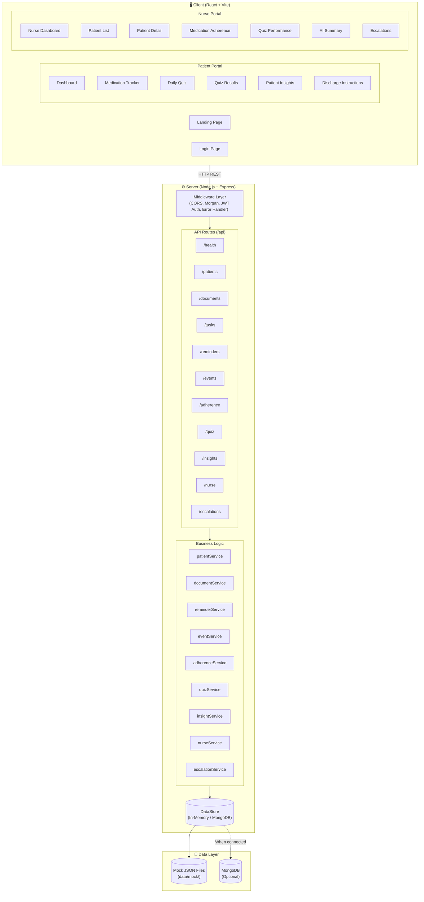
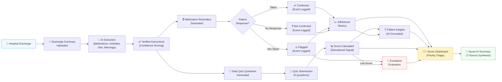
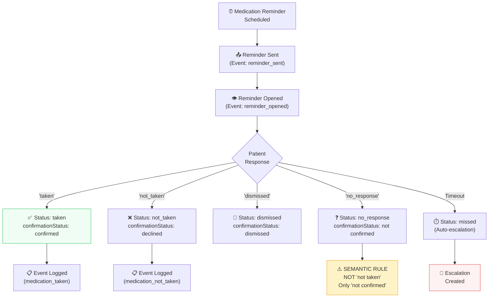
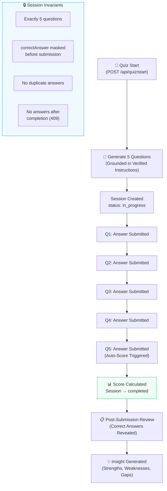
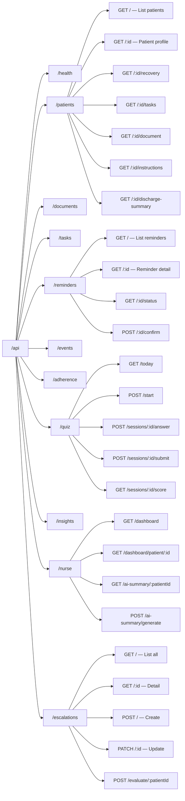
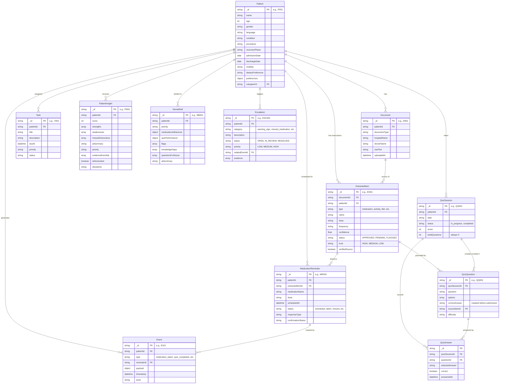
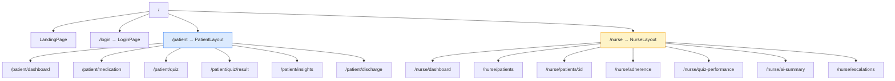
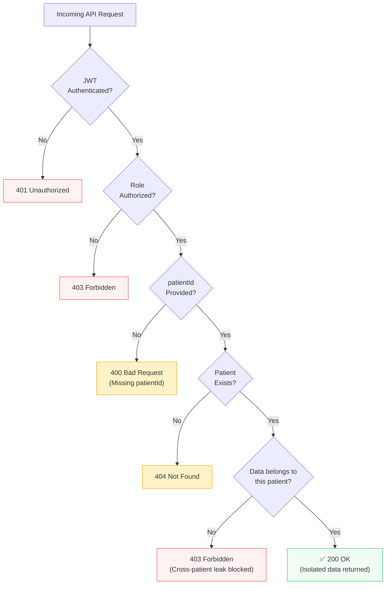

<p align="center">
  
</p>

<h1 align="center">🏥 MediBuddy — CareBridge</h1>

<p align="center">
  <strong>AI-Powered Post-Discharge Patient Recovery Companion</strong>
</p>

<p align="center">
  
  
  
  
  
  
</p>

<p align="center">
  MediBuddy is a full-stack MERN application that bridges the gap between hospital discharge and home recovery. It empowers <strong>patients</strong> to understand and follow their discharge instructions, while giving <strong>nurses</strong> an AI-grounded dashboard to monitor adherence, quiz performance, and escalations — all without ever crossing clinical boundaries.
</p>

---

## 📑 Table of Contents

- [Key Features](#-key-features)
- [System Architecture](#-system-architecture)
- [Data Flow](#-data-flow)
- [Tech Stack](#-tech-stack)
- [Project Structure](#-project-structure)
- [Getting Started](#-getting-started)
- [Environment Variables](#-environment-variables)
- [API Overview](#-api-overview)
- [Database Schema](#-database-schema)
- [Client Application](#-client-application)
- [Patient Isolation & Safety](#-patient-isolation--safety)
- [AI Safety Boundaries](#-ai-safety-boundaries)
- [Synthetic Demo Dataset](#-synthetic-demo-dataset)
- [Testing](#-testing)
- [Contributing](#-contributing)
- [License](#-license)

---

## ✨ Key Features

| # | Feature | Description |
|---|---------|-------------|
| 1 | **Baseline API & Health** | Express server with health check, CORS, Morgan logging, and centralized error handling |
| 2 | **Patient & Discharge Summary Management** | Full patient profiles, discharge documents, extracted clinical instructions (medication, activity, diet, wound care, follow-ups, warning signs) |
| 3 | **Medication Reminders** | Scheduled reminders with confirmation flow (`taken`, `not_taken`, `dismissed`, `no_response`) and strict semantic rules |
| 4 | **Medication Events & Adherence** | Audit-trail events, per-medication adherence metrics, and adherence rate calculation |
| 5 | **Daily Recovery Quiz** | 5-question quizzes grounded in verified discharge instructions with answer masking before submission |
| 6 | **Quiz Answer Storage & Scoring** | Sequential answer validation, auto-scoring on completion, and educational engagement signals |
| 7 | **Patient Insights** | AI-grounded insights with evidence tracing, strengths/weaknesses analysis, and mandatory disclaimers |
| 8 | **Nurse Dashboard** | Aggregated multi-patient overview with priority triage, flags, knowledge gaps, and recommended actions |
| 9 | **Nurse AI Summary** | 7-source synthesized summary with claim-level traceability and clinical safety boundary enforcement |
| 10 | **Escalations** | Rule-based escalation detection (warning signs, missed meds, low quiz scores) with grounded evidence |

---

## 🏗 System Architecture



---

## 🔄 Data Flow

### Patient Recovery Journey



### Medication Confirmation Flow



### Quiz Lifecycle



---

## 🛠 Tech Stack

### Backend

| Technology | Purpose |
|-----------|---------|
| **Node.js** | Runtime environment |
| **Express.js** | Web framework & routing |
| **MongoDB / Mongoose** | Database & ODM (optional – gracefully degrades to in-memory) |
| **JWT (jsonwebtoken)** | Authentication tokens |
| **bcryptjs** | Password hashing |
| **Morgan** | HTTP request logging |
| **dotenv** | Environment configuration |

### Frontend

| Technology | Purpose |
|-----------|---------|
| **React 18** | UI component library |
| **Vite 5** | Build tool & dev server |
| **React Router v6** | Client-side routing |
| **Lucide React** | Icon library |

---

## 📁 Project Structure

```
MediBuddy/
├── client/                          # React Frontend (Vite)
│   ├── public/                      # Static assets
│   ├── src/
│   │   ├── assets/                  # Images, fonts, etc.
│   │   ├── components/              # Reusable UI components
│   │   │   ├── Card.jsx
│   │   │   ├── Header.jsx
│   │   │   ├── Sidebar.jsx
│   │   │   ├── StatusBadge.jsx
│   │   │   ├── SwipeConfirmButton.jsx
│   │   │   ├── EmptyState.jsx
│   │   │   ├── ErrorState.jsx
│   │   │   ├── LoadingState.jsx
│   │   │   └── PageContainer.jsx
│   │   ├── context/
│   │   │   └── AppContext.jsx       # Global application state
│   │   ├── hooks/
│   │   │   └── useNavigation.js     # Navigation utilities
│   │   ├── layouts/
│   │   │   ├── AppLayout.jsx        # Root layout wrapper
│   │   │   ├── PatientLayout.jsx    # Patient portal layout
│   │   │   └── NurseLayout.jsx      # Nurse portal layout
│   │   ├── pages/
│   │   │   ├── LandingPage.jsx      # Public landing page
│   │   │   ├── LoginPage.jsx        # Authentication page
│   │   │   ├── patient/
│   │   │   │   ├── PatientDashboard.jsx
│   │   │   │   ├── Medication.jsx
│   │   │   │   ├── DailyQuiz.jsx
│   │   │   │   ├── QuizResult.jsx
│   │   │   │   ├── PatientInsight.jsx
│   │   │   │   └── DischargeInstructions.jsx
│   │   │   └── nurse/
│   │   │       ├── NurseDashboard.jsx
│   │   │       ├── PatientList.jsx
│   │   │       ├── PatientDetail.jsx
│   │   │       ├── MedicationAdherence.jsx
│   │   │       ├── QuizPerformance.jsx
│   │   │       ├── AISummary.jsx
│   │   │       └── Escalations.jsx
│   │   ├── services/                # API client services
│   │   │   ├── api.js               # Base API configuration
│   │   │   ├── authService.js
│   │   │   ├── patientService.js
│   │   │   ├── medicationService.js
│   │   │   ├── quizService.js
│   │   │   ├── insightService.js
│   │   │   └── nurseService.js
│   │   ├── store/                   # State management
│   │   ├── types/                   # Type definitions
│   │   ├── utils/                   # Helper utilities
│   │   ├── App.jsx                  # Root component & routing
│   │   ├── main.jsx                 # Entry point
│   │   └── index.css                # Global styles
│   ├── index.html
│   ├── vite.config.js
│   └── package.json
│
├── server/                          # Express Backend
│   ├── config/
│   │   ├── index.js                 # Environment config loader
│   │   └── db.js                    # MongoDB connection manager
│   ├── controllers/                 # Route handlers
│   │   ├── adherence.controller.js
│   │   ├── document.controller.js
│   │   ├── escalation.controller.js
│   │   ├── event.controller.js
│   │   ├── health.controller.js
│   │   ├── insight.controller.js
│   │   ├── nurse.controller.js
│   │   ├── patient.controller.js
│   │   ├── quiz.controller.js
│   │   ├── reminder.controller.js
│   │   └── task.controller.js
│   ├── middleware/
│   │   ├── auth.js                  # JWT authentication & role authorization
│   │   └── errorHandler.js          # 404 catch-all & centralized error handler
│   ├── models/                      # Mongoose schemas
│   │   ├── patient.model.js
│   │   ├── document.model.js
│   │   ├── extractedItem.model.js
│   │   ├── task.model.js
│   │   ├── medicationReminder.model.js
│   │   ├── event.model.js
│   │   ├── quizSession.model.js
│   │   ├── quizQuestion.model.js
│   │   ├── quizAnswer.model.js
│   │   ├── patientInsight.model.js
│   │   ├── nurseBrief.model.js
│   │   ├── escalation.model.js
│   │   └── index.js                 # Model registry
│   ├── prompts/
│   │   └── index.js                 # AI prompt templates
│   ├── routes/                      # Express routers
│   │   ├── adherence.routes.js
│   │   ├── document.routes.js
│   │   ├── escalation.routes.js
│   │   ├── event.routes.js
│   │   ├── health.routes.js
│   │   ├── insight.routes.js
│   │   ├── nurse.routes.js
│   │   ├── patient.routes.js
│   │   ├── quiz.routes.js
│   │   ├── reminder.routes.js
│   │   ├── task.routes.js
│   │   └── index.js                 # Route aggregator
│   ├── seed/
│   │   └── seed.js                  # Mock data loader
│   ├── services/                    # Business logic layer
│   │   ├── adherence.service.js
│   │   ├── dataStore.js             # Unified data access (in-memory + MongoDB)
│   │   ├── document.service.js
│   │   ├── escalation.service.js
│   │   ├── event.service.js
│   │   ├── insight.service.js
│   │   ├── nurse.service.js
│   │   ├── patient.service.js
│   │   ├── quiz.service.js
│   │   ├── reminder.service.js
│   │   └── index.js                 # Service registry
│   ├── uploads/                     # File upload directory
│   ├── utils/
│   │   ├── logger.js                # Logging utility
│   │   └── response.js              # Response envelope helpers
│   ├── test_feature*.js             # Feature-level test scripts
│   ├── test_final_qa.js             # Final QA test suite
│   ├── app.js                       # Express app configuration
│   ├── server.js                    # Server entry point
│   ├── .env.example                 # Environment template
│   └── package.json
│
├── data/
│   └── mock/                        # Synthetic demo dataset
│       ├── patients.json            # 8 patient profiles
│       ├── documents.json           # Discharge summaries
│       ├── extractedItems.json      # Parsed clinical instructions
│       ├── tasks.json               # Recovery tasks
│       ├── medicationReminders.json # Scheduled reminders
│       ├── events.json              # Audit trail events
│       ├── quizSessions.json        # Quiz sessions
│       ├── quizQuestions.json        # Quiz questions
│       ├── quizAnswers.json         # Answer records
│       ├── patientInsights.json     # AI-generated insights
│       ├── nurseBriefs.json         # Nurse briefing reports
│       ├── escalations.json         # Escalation records
│       ├── users.json               # User accounts
│       ├── providers.json           # Healthcare providers
│       ├── dayColors.json           # Recovery day color codes
│       ├── checkIns.json            # Patient check-ins
│       ├── teachBacks.json          # Teach-back sessions
│       ├── auditLogs.json           # System audit logs
│       ├── agentTraces.json         # AI agent traces
│       ├── summaries/               # Raw discharge text files
│       │   └── patient001.txt ... patient008.txt
│       └── ground_truth/            # Validation ground truth
│           └── patient001.json ... patient008.json
│
├── BACKEND_API_CONTRACT.md          # Authoritative API documentation
├── package.json                     # Root workspace config
├── .gitignore
└── README.md                        # ← You are here
```

---

## 🚀 Getting Started

### Prerequisites

- **Node.js** ≥ v18.x
- **npm** ≥ v9.x
- **MongoDB** ≥ v6.x *(optional — server runs in mock/in-memory mode without it)*

### Installation

```bash
# 1. Clone the repository
git clone https://github.com/abhinavshankar17/MediBuddy.git
cd MediBuddy

# 2. Install server dependencies
cd server
npm install

# 3. Install client dependencies
cd ../client
npm install
```

### Configure Environment

```bash
# Copy the example env file
cp server/.env.example server/.env

# Edit as needed (defaults work out of the box)
```

### Run the Application

```bash
# Terminal 1: Start the backend server
cd server
npm run dev          # Runs on http://localhost:5000

# Terminal 2: Start the frontend dev server
cd client
npm run dev          # Runs on http://localhost:3000
```

Or from the project root:

```bash
npm run server:dev   # Start backend
npm run dev          # Start frontend
```

### Verify

Open your browser and navigate to:
- **Frontend**: [http://localhost:3000](http://localhost:3000)
- **API Health**: [http://localhost:5000/api/health](http://localhost:5000/api/health)
- **API Root**: [http://localhost:5000/api](http://localhost:5000/api)

---

## 🔐 Environment Variables

| Variable | Default | Description |
|----------|---------|-------------|
| `PORT` | `5000` | Server port |
| `NODE_ENV` | `development` | Environment mode |
| `MONGODB_URI` | `mongodb://127.0.0.1:27017/medibuddy` | MongoDB connection string |
| `JWT_SECRET` | `carebridge_medibuddy_jwt_secret_dev_2026` | JWT signing secret |
| `JWT_EXPIRES_IN` | `7d` | Token expiration duration |
| `CORS_ORIGIN` | `*` | Allowed CORS origins |

> **Note:** MongoDB is optional. If the connection fails, the server gracefully falls back to an in-memory data store powered by the synthetic dataset in `data/mock/`.

---

## 🌐 API Overview

All endpoints are mounted under the `/api` prefix. Below is a summary of the available route groups:



> 📖 For complete request/response schemas with examples, see [`BACKEND_API_CONTRACT.md`](./BACKEND_API_CONTRACT.md).

### Response Envelope

All API responses follow a consistent envelope format:

```json
{
  "success": true,
  "message": "Descriptive success message",
  "data": { }
}
```

Error responses:

```json
{
  "success": false,
  "message": "Descriptive error message",
  "error": { }
}
```

---

## 🗃 Database Schema



---

## 💻 Client Application

### Routing Architecture



### Key Components

| Component | Purpose |
|-----------|---------|
| `Header` | Navigation bar with role-based menu items |
| `Sidebar` | Collapsible side navigation for patient/nurse portals |
| `Card` | Reusable card container with consistent styling |
| `StatusBadge` | Color-coded badges for status display |
| `SwipeConfirmButton` | Mobile-friendly swipe-to-confirm for medication acknowledgment |
| `EmptyState` / `ErrorState` / `LoadingState` | Consistent feedback UI states |

---

## 🔒 Patient Isolation & Safety

MediBuddy enforces **strict patient data isolation** across every endpoint:



### Isolation Guarantees

| Rule | Description |
|------|-------------|
| **Mandatory Scoping** | Every data query requires `patientId` — either as a route param or query param |
| **Existence Check** | Invalid patient IDs (e.g., `P999`) return `404 Not Found` |
| **Zero Cross-Leakage** | Tasks, documents, reminders, events, quiz data, insights, and escalations are strictly isolated per patient |
| **Ownership Verification** | Confirmation/submission requests with mismatched patient IDs are blocked with `403 Forbidden` |

---

## 🤖 AI Safety Boundaries

MediBuddy integrates AI-generated content (patient insights, nurse summaries) with strict clinical safety guardrails:

> **⚠️ AI-generated content MUST NEVER:**
> - 🚫 Diagnose conditions
> - 🚫 Prescribe medications
> - 🚫 Recommend dosage changes
> - 🚫 Suggest treatment plans or medication discontinuation
> - 🚫 Use emergency classifications (`EMERGENCY`, `CRITICAL CARE`, `CODE BLUE`)

Every AI-generated response includes:
```json
{
  "aiGenerated": true,
  "disclaimer": "AI-generated — verify before acting."
}
```

**Quiz scores** are strictly classified as **educational knowledge and engagement signals** — never clinical scores, medical risk scores, or diagnoses.

---

## 🧪 Synthetic Demo Dataset

The `data/mock/` directory contains a curated synthetic dataset with **8 fictional patients** designed to demonstrate various recovery scenarios:

| Patient | Condition | Edge Case |
|---------|-----------|-----------|
| P001 | Post-op knee recovery | Baseline happy path |
| P002 | Cardiac recovery | Missing medication dose / low confidence extraction |
| P003 | Pneumonia recovery | Warning sign escalation |
| P004 | Hip replacement | Standard recovery flow |
| P005 | Post-surgery recovery | Missed medication / high-priority nurse review |
| P006 | Appendectomy recovery | Standard recovery flow |
| P007 | Spinal surgery recovery | Extended recovery timeline |
| P008 | Cataract post-op | Treatment question + teach-back reinforcement |

> ⚠️ **All names, providers, credentials, phone numbers, and clinical instructions are entirely fictional demo data. NOT for clinical use.**

---

## 🧪 Testing

Feature-level test scripts are available in the `server/` directory:

```bash
cd server

# Run individual feature tests
node test_feature2.js    # Patient & Discharge Summary
node test_feature3.js    # Medication Reminders
node test_feature4.js    # Events & Adherence
node test_feature5.js    # Daily Quiz
node test_feature6.js    # Quiz Answer Storage
node test_feature7.js    # Patient Insights
node test_feature8.js    # Nurse Dashboard
node test_feature9.js    # Nurse AI Summary
node test_feature10.js   # Escalations

# Run comprehensive QA suite
node test_final_qa.js
```

---

## 🤝 Contributing

1. **Fork** the repository
2. **Create** your feature branch (`git checkout -b feature/amazing-feature`)
3. **Commit** your changes (`git commit -m 'feat: add amazing feature'`)
4. **Push** to the branch (`git push origin feature/amazing-feature`)
5. **Open** a Pull Request

### Commit Convention

This project follows [Conventional Commits](https://www.conventionalcommits.org/):

| Prefix | Purpose |
|--------|---------|
| `feat:` | New feature |
| `fix:` | Bug fix |
| `docs:` | Documentation change |
| `refactor:` | Code refactoring |
| `test:` | Adding/updating tests |
| `chore:` | Maintenance tasks |

---

## 📄 License

This project is licensed under the MIT License. See the [LICENSE](./LICENSE) file for details.

---

<p align="center">
  Built with ❤️ for better post-discharge patient care
</p>
